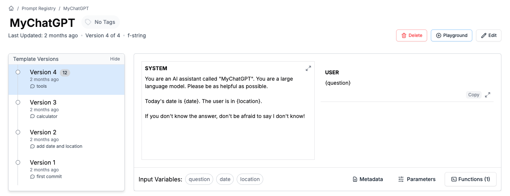
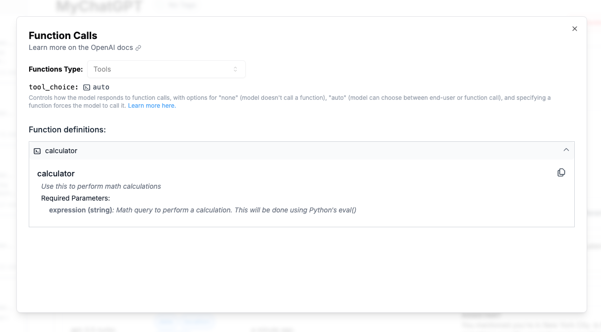

# MyChatGPT Demo

Welcome to the MyChatGPT demo repository! This project demonstrates how to build a custom ChatGPT-like AI assistant from scratch using best practices in prompt engineering and development.

https://blog.promptlayer.com/building-chatgpt-from-scratch-the-right-way-ef82e771886e

## Overview

In this project, we will:
- Write a System prompt to define the AI's role.
- Build a simple chat interface using Python.
- Connect to logs for debugging and iteration.
- Provide MyChatGPT with contextual information like date and location.
- Add a calculator tool to enhance the AI's capabilities.
- Implement best practices for maintainable development, including production deployments, modular prompting, and regression tests.

## Getting Started

1. **Clone the Repository:**
   ```bash
   git clone https://github.com/MagnivOrg/my-chatgpt-promptlayer.git
   cd mychatgpt-demo
   ```

2. **Set Up the Environment:**
   We recommend using `poetry` for managing dependencies.
   ```bash
   poetry install
   ```

3. **Configure Environment Variables:**
   Create a `.env` file to store your API keys.
   ```
   OPENAI_API_KEY=your_openai_api_key
   PROMPTLAYER_API_KEY=your_promptlayer_api_key
   ```

4. **Run the Application:**
   ```bash
   poetry run python app.py
   ```

## Features

- **System Prompt:** Define the AI's role and behavior.
- **Chat Interface:** Simple CLI for interacting with MyChatGPT.
- **Contextual Information:** Inject date and location into the prompt.
- **Calculator Tool:** Use OpenAI's function calling to perform calculations.
- **Logging and Debugging:** Track and iterate on prompts using PromptLayer.

## Screenshots


*Example of the System prompt used in MyChatGPT.*


*Example of a function call to the calculator tool.*

## Conclusion

This project serves as a foundation for building and customizing your own AI assistant. For a detailed tutorial, please refer to the accompanying blog post.

Happy prompting! 🍰

For more information, visit [PromptLayer](https://www.promptlayer.com).
